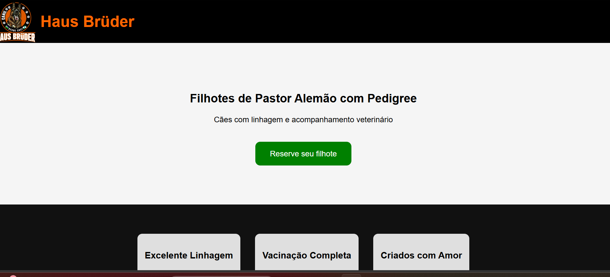

# 🐶 Landing Page Canil

## 📖 Sobre
Landing page desenvolvida com foco em vendas e facilitando o contato direto com clientes.

## 🛠 Tecnologias
- HTML5
- CSS3

## 🎯 Funcionalidades
- Apresentação do canil  
- Exibição de filhotes em destaque (cards)  
- Galeria de fotos  
- Layout responsivo  
- Botão de contato direto via WhatsApp  

## ▶️ Como executar
Abra o arquivo `index.html` no navegador

## 📷 Preview

## 🔗 Acesse o projeto
https://alexandrelemosdev.github.io/lading-page-canil/

## 📚 Aprendizados
Neste projeto foram aplicados conceitos de criação de landing pages, organização de layout e foco em conversão de usuários.
